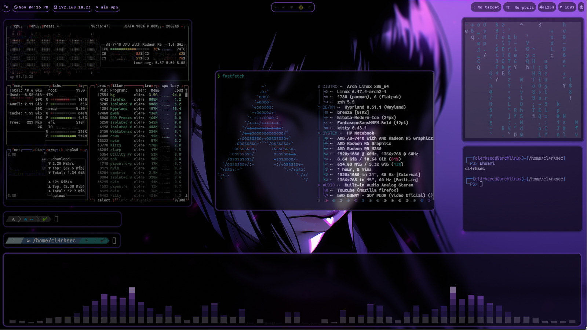
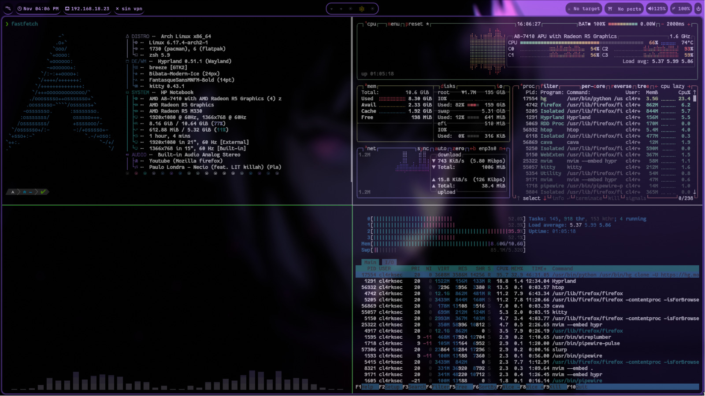

# 🌌 ＣＥＬＥＳＴＩＡＬ  ＆  ＨＹＰＲＬＡＮＤ  (ＡＲＣＨ  ＬＩＮＵＸ)

> Entorno unificado de escritorio de ultra alto rendimiento para **Arch Linux**, **Garuda Linux**, **EndeavourOS**, **CachyOS** y derivados.
> Fusiona la experiencia estética y fluida de **Celestial / Caelestia Shell (Quickshell)** con el ecosistema completo de **Hyprland**, sincronización de SDDM y paletas dinámicas con **Wallust**.

---





---

## ✨ Características Principales

- 🚀 **Instalación con 0 Margen de Error**: Script completamente desatendido e interactivo con autodetección de hardware, soporte para `yay` y `paru`, resolución de conflictos de paquetes y configuración de PipeWire.
- 🛸 **Celestial / Caelestia Shell**: Interfaz y widgets construidos con **Quickshell** y QML moderno.
- 📊 **Fallback Automático con Waybar & SwayNC**: Si Quickshell o Caelestia no están activos, la barra Waybar y el centro de notificaciones SwayNC entran en acción de inmediato.
- 🎨 **Armonía de Color Dinámica (Wallust)**: Los temas de terminal (Kitty), barras, menús (Rofi) y pantalla de bloqueo se sincronizan al instante con el fondo de pantalla seleccionado.
- 🌘 **Sincronización SDDM**: El fondo de pantalla y los colores seleccionados se sincronizan automáticamente con la pantalla de login (SDDM).
- ⚡ **Terminal Zsh + Powerlevel10k**: Configurada con autocompletado inteligente, resaltado de sintaxis y utilidades del sistema.

---

## 🛠️ Instalación en un Solo Comando

### Opción 1 (Recomendada - Directo vía curl):
```bash
bash -c "$(curl -fsSL https://raw.githubusercontent.com/zarateaz/celestial/main/install.sh)"
```

### Opción 2 (Vía Git Clone):
```bash
git clone --recurse-submodules https://github.com/zarateaz/celestial.git && cd celestial && chmod +x install.sh && ./install.sh
```

> [!NOTE]
> El instalador detecta si tienes `yay` o `paru`, resuelve conflictos entre paquetes (`quickshell` vs `quickshell-git`, `rofi` vs `rofi-wayland`), compila las herramientas necesarias, activa servicios de audio PipeWire y genera la configuración óptima para tu monitor y touchpad.

---

## ⌨️ Atajos de Teclado Principales

| Atajo | Función |
| :--- | :--- |
| <kbd>SUPER</kbd> + <kbd>D</kbd> | Abrir lanzador de aplicaciones (Rofi / Caelestia Drawer) |
| <kbd>SUPER</kbd> + <kbd>Return</kbd> | Abrir terminal (Kitty) |
| <kbd>SUPER</kbd> + <kbd>E</kbd> | Abrir explorador de archivos (Thunar) |
| <kbd>SUPER</kbd> + <kbd>Q</kbd> | Cerrar ventana activa |
| <kbd>SUPER</kbd> + <kbd>Espacio</kbd> | Alternar ventana flotante / mosaico |
| <kbd>SUPER</kbd> + <kbd>Shift</kbd> + <kbd>F</kbd> | Pantalla completa total |
| <kbd>SUPER</kbd> + <kbd>1-9</kbd> | Cambiar de escritorio (Workspaces 1 al 10) |
| <kbd>SUPER</kbd> + <kbd>W</kbd> | Selector visual de fondos de pantalla |
| <kbd>SUPER</kbd> + <kbd>Shift</kbd> + <kbd>S</kbd> | Captura de pantalla con editor visual (Swappy) |
| <kbd>SUPER</kbd> + <kbd>L</kbd> | Bloquear pantalla (Caelestia Lock / Hyprlock) |
| <kbd>Ctrl</kbd> + <kbd>Alt</kbd> + <kbd>P</kbd> | Menú de energía (Apagar / Reiniciar / Suspender) |
| <kbd>SUPER</kbd> + <kbd>H</kbd> | Ver chuleta de atajos en pantalla |

---

## 📂 Estructura del Repositorio

- `shell/`: Código fuente QML y C++ de Caelestia Shell.
- `configs/`: Dotfiles completos (`hypr`, `kitty`, `rofi`, `waybar`, `swaync`, `wallust`, `cava`, `fastfetch`, `bin`, etc.).
- `wallpapers/`: Colección curada de fondos de pantalla en alta resolución.
- `scripts/`: Scripts de integración de sistema, SDDM y Wallust.
- `install.sh`: Script maestro de instalación sin errores.

---

*Diseñado por [zarateaz](https://github.com/zarateaz)*
